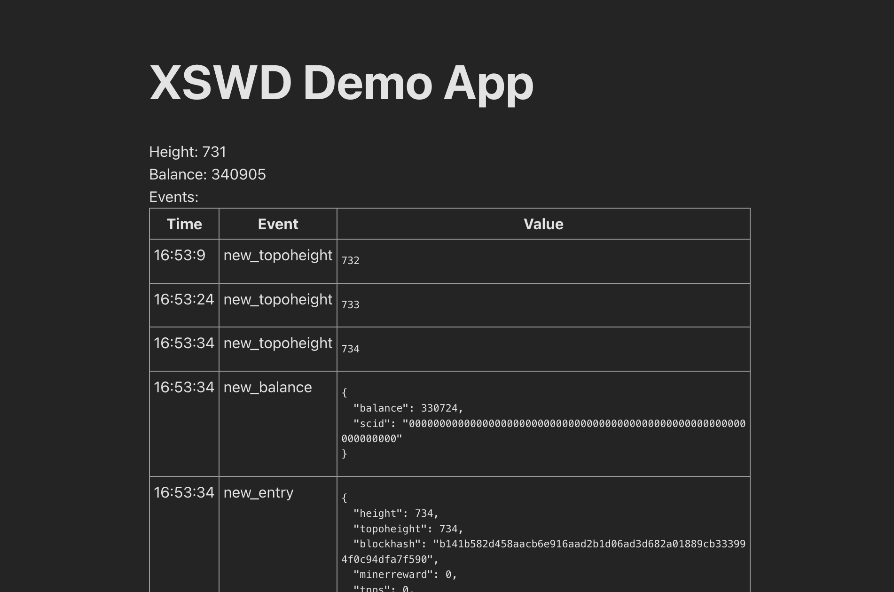

# Demo React-TS for xswd-api

A simple applet that demonstrate authentication, requests and events.



## Setup

* Have a running wallet on your machine that support XSWD
* Enable XSWD server (option 16 for CLI wallet)

## Development
```sh
# start dev server
yarn && yarn dev
```
